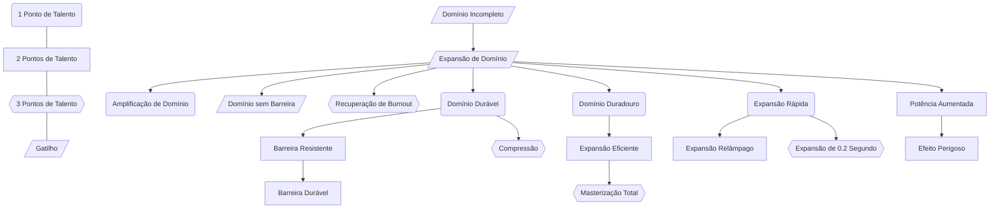

A Expansão de Domínio é a técnica mais suprema de qualquer usuário de jujutsu. Ela é alcançada expandindo o domínio inato do usuário com energia amaldiçoada, enquanto se utiliza uma barreira para construí-la dentro de um espaço separado. O usuário então imbuí sua técnica amaldiçoada dentro da barreira para completar a expansão, permitindo-lhe implantar sua habilidade por todo o domínio.

## Expandindo o Domínio
Todos os domínios exigem um sinal de mão específico para que sua expansão seja ativada, exigindo um turno completo (ação + movimentação) para serem ativados. Todos os domínios custam 18 de Energia Amaldiçoada, a menos que especificado, e capturam todas as criaturas à sua escolha em um círculo de 20 unidades de diâmetro centrado em você, criando uma barreira por 5 turnos. O interior de uma expansão de domínio varia de jogador para jogador, já que é como mostrar sua alma aos seus oponentes. Fora do seu domínio, sua aparência é a de uma esfera negra gigante flutuando no ar.

## Burnout de Técnica
Mesmo que a barreira ou o ambiente não estejam totalmente formados, conjurar a expansão de domínio fará com que o feitiço do usuário se torne instável por um curto período de tempo. Imediatamente após o término da expansão de domínio, você não poderá usar nada relacionado ao seu feitiço e sofrerá 2 níveis de exaustão por 5 turnos, ou até acertar um fulgor negro.

# Domínios Letais
Domínios expandidos para serem letais são construídos dentro de uma barreira imbuída com feitiço do usuário. As habilidades do conjurador são amplificadas e o feitiço do usuário do domínio têm garantia de atingir o alvo. Esse fator de acerto garantido deriva do feitiço embutido na barreira, o que torna esse tipo de domínio considerado letal.
## Efeito de Acerto Garantido
Enquanto estiver dentro do raio de alcance do seu domínio, seu feitiço será afetado por um efeito de acerto garantido. Não importa o resultado da sua jogada de ataque com energia amaldiçoada, ela será considerada um acerto. Criaturas falharão automaticamente em testes de resistência contra sua técnica amaldiçoada. Este e quaisquer outros efeitos do seu domínio se aplicam apenas a alvos que você escolher dentro dele.
# Domínios Não-Letais
No passado, a Expansão de Domínio era uma técnica mais comum porque os domínios não eram construídos para serem fatais. Eles apenas forçavam os alvos dentro deles a obedecerem às regras da técnica amaldiçoada embutida.

## Tratado de Paz
Dentro de domínios não letais, nenhum tipo de violência é permitido enquanto uma condição não for completamente cumprida. Após a condição ser cumprida, o domínio será encerrado.

## Conflito Anti-Domínio
Como seu domínio tem uma condição pacífica, você não pode abri-lo enquanto outra expansão de domínio estiver ativa. No entanto, expansões de domínio letais não podem ser abertas como reação à abertura do seu domínio. Você pode usar sua reação para abrir seu domínio contra um domínio letal, caso em que o conflito é diferente. O domínio com mais pontos de refinamento destrói instantaneamente o outro. No caso de dois domínios não letais se abrirem, aquele com mais pontos de refinamento vencerá instantaneamente.
# Pontos Fracos
Todos os tipos de técnicas de barreira têm um ponto fraco, e com as expansões de domínio não é diferente. Você só pode causar dano aos pontos de vida de um domínio depois de encontrar seu ponto fraco, a menos que esteja fora do domínio.

## De Dentro
Quebrar uma barreira por dentro é quase impossível; mesmo que você encontre o ponto fraco, ainda será alvo dos efeitos constantes do domínio. Para quebrar um domínio por dentro, você deve primeiro encontrar seu ponto fraco fazendo um teste de Percepção CD 25. Em caso de falha, o alvo não poderá encontrar um ponto fraco. Em caso de sucesso, você encontrará o ponto fraco do domínio, podendo agora atacá-lo.

## De Fora
Embora quebrar uma barreira por dentro seja quase impossível, quebrá-la por fora é uma tarefa muito mais fácil. Você pode atacar o domínio. Ele falha automaticamente em quaisquer testes de resistência e é vulnerável a todos os tipos de dano que você causar, exceto dano psíquico.

## Criando um Ponto Fraco
Às vezes, mesmo que pareça uma desvantagem, você pode entrar à força em uma expansão de domínio criando um ponto fraco, geralmente uma espécie de buraco. Depois de atingir pelo menos 1/3 dos pontos de vida máximos do domínio, você pode usar uma ação para fazer um teste de resistência de Corpo, Mente ou Ego para abrir o domínio à força. Em caso de falha, o domínio não terá um buraco. Em caso de sucesso, você criará um buraco de 2x2 unidades no domínio, permitindo que você e quaisquer criaturas entrem. No momento em que qualquer criatura entrar no domínio, ela sofrerá os efeitos do acerto certeiro.

# Conflito de Domínio
A expansão simultânea de dois domínios causa um conflito de domínios, uma batalha definida exclusivamente por quem possui o domínio mais refinado e o maior talento como feiticeiro.
Assim que uma criatura expande seu domínio, você pode usar sua reação para expandir o seu também. A batalha de domínios será definida por quem tiver mais pontos de refinamento, sendo esse o fator determinante para a vitória. Contudo, mesmo que você tenha pontos de refinamento suficientes para destruir o domínio oponente, isso levará um número de rodadas igual à quantidade de pontos de refinamento que você possui acima do domínio do oponente. Consulte a tabela abaixo para saber quantas rodadas são necessárias:

| Pontos de Refinamento Acima | Rodadas Requeridas |
| --------------------------- | ------------------ |
| 1                           | 9                  |
| 2                           | 8                  |
| 3                           | 7                  |
| 4                           | 6                  |
| 5                           | 5                  |
| 6                           | 4                  |
| 7                           | 3                  |
| 8                           | 2                  |
| 9                           | 1                  |
| 10+                         | 0                  |
Durante o conflito de domínios, o efeito de acerto garantido de ambos os domínios será anulado. As expansões de domínio criarão uma área de 30 unidades, onde 15 unidades estarão dentro da área de um domínio, enquanto as outras 15 unidades pertencerão ao domínio do outro. A área do domínio perdedor diminuirá em 3 unidades por rodada. Logo após você romper o domínio, seu efeito de acerto garantido voltará a funcionar.
## Conflito de Refinamento Igual
Embora seja um cenário extremamente improvável, quando duas Expansões de Domínio de refinamento igual se confrontam, elas se anulam completamente, não podendo sobrepujar nem ser sobrepujadas. Assim, cabe aos dois feiticeiros manterem seus domínios enquanto enfraquecem o do oponente. Assim que um dos conjuradores de domínio atingir 1/3 (arredondado para baixo) de seus pontos de vida máximos, ele precisa obter sucesso em um teste de CD 15 sem modificadores para manter a concentração em seu domínio. Em caso de sucesso, o domínio permanece estável e eles podem continuar. Em caso de falha, seu domínio se rompe, cedendo ao do oponente, e eles sofrem os efeitos da Exaustão por Expansão de Domínio.

## Conflitos de Domínio Múltiplos
Uma batalha entre duas expansões de domínio já é difícil de descrever, imagine então uma com três ou mais... Quando três ou mais domínios estão envolvidos, as regras são as mesmas, com os domínios de menor refinamento sendo destruídos assim que as rodadas necessárias passarem. A barreira é expandida em 15 unidades. por domínio envolvido, com os domínios mais fracos sendo reduzidos em 3 unidades no início de cada rodada.

# Refinamento de Domínio
Como toda técnica, a Expansão de Domínio melhora com o aprimoramento e a especialização. Um domínio aprimorado e um domínio normal são muito diferentes; enquanto no segundo caso, a maioria dos feiticeiros de grau 1 ou superior conseguiria escapar, um domínio aprimorado pode causar problemas até mesmo para feiticeiros de nível especial.
## Pontos de Aprimoramento
Quanto mais você aprimorar seu domínio, mais pontos de aprimoramento ele acumulará. Você começará com 1 ponto de aprimoramento, que define muitas características do seu domínio. Seu limite de aprimoramento é de 30 pontos, e apenas a elite da elite alcançou esse patamar.

## Formas de Aprimoramento
Existem várias maneiras de aprimorar seu domínio, desde treinar consigo mesmo até confrontar os domínios de outras pessoas. Abaixo está uma lista de como obter pontos de aprimoramento:

| Método                   | Descrição                                                                                                                                                                                                                                                                                                                                                                                                                        | Recompensa |
| ------------------------ | -------------------------------------------------------------------------------------------------------------------------------------------------------------------------------------------------------------------------------------------------------------------------------------------------------------------------------------------------------------------------------------------------------------------------------- | ---------- |
| Treinamento              | Provavelmente o método mais lento, mas cada pequeno progresso conta. Entre descanso, você pode usar seu tempo livre para treinar seu domínio, aumentando levemente seu nível de refinamento.                                                                                                                                                                                                                                     | 1          |
| Casualidades no Domínio  | Um dos métodos mais rápidos de refinar seu domínio é destruir oponentes com suas técnicas amaldiçoadas enquanto estiver dentro dele. Se você reduzir os pontos de vida de uma criatura a 0 enquanto ela estiver dentro da sua expansão de domínio, você ganhará pontos de refinamento. Os pontos de refinamento só são ganhos se o ND (Nível de Desafio) da criatura for pelo menos metade do seu nível (arredondado para cima). | 2/Criatura |
| Superioridade de Domínio | Basta subjugar outro com o seu próprio domínio. Se você vencer um conflito de domínio, ganhará pontos de refinamento pela sua superioridade de domínio. Você só pode se beneficiar disso uma vez por descanso.                                                                                                                                                                                                                   | 5 Pontos   |

# Habilidades de Refinamento

## Domínio Incompleto
Através de um estudo profundo da sua técnica e muita criatividade, você alcançou um domínio incompleto. Como uma ação por 9 de energia amaldiçoada, você pode expandir seu domínio incompleto em um círculo de 10 metros ao seu redor por 5 turnos. Para isso, você deve estar cercado por objetos ou barreiras em todos os lados, a até 20 unidades de distância, já que você ainda não aprendeu a aplicar uma barreira. Como você não imbuiu um feitiço em seu domínio, ele não terá um efeito de acerto garantido; no entanto, ainda aprimorará seu feitiço, permitindo que você faça testes de ataque com energia amaldiçoada com vantagem, e as criaturas terão desvantagem ao fazer testes de resistência contra sua técnica amaldiçoada. Seu domínio terá os mesmos efeitos que seu domínio completo; contudo, quaisquer dados de dano, duração do efeito ou reduções de custo serão reduzidos à metade. Caso seu domínio reduza o custo das técnicas amaldiçoadas a 0, ele será apenas reduzido à metade.
## Expansão de Domínio
Você aprende a expandir seu domínio completamente. O efeito de acerto garantido e quaisquer bônus são definidos pelo seu Feitiço.
### Amplificação de Domínio
Você aprendeu como utilizar o poder de um domínio sem usá-lo ativamente. Como Ação custando metade da Energia Amaldiçoada que seu domínio requer, você pode cobrir seu corpo para "vestir" seu domínio afim de neutralizar técnicas amaldiçoadas por 5 turnos. Uma vez ativado, você nega automaticamente qualquer técnica defensiva, técnica ofensiva ou encantamento que o afete e pode ignorar barreiras como a do [[Feitiços/Ilimitado|Ilimitado]]. Esta técnica não negará o efeito de acerto garantido de um domínio se estiver dentro dele, entretanto. 
Entretanto, você não pode usar seu Feitiço a menos que dispense Amplificação de Domínio como uma reação. Mesmo se a dispensar, você pode reativá-la como uma reação por 5 turnos sem gastar a energia amaldiçoada novamente. Esta técnica não funciona contra Liberação Máxima de Técnica, Técnica com Entoamento e Técnica Maximum, o garantindo apenas resistência ao invés de imunidade.
### Domínio Durável
Seu domínio se tornará mais resistente quanto mais refinado for. Seus pontos de vida de domínio aumentam em +1 para cada ponto de refinamento que você possuir.
#### Barreira Resistente
Quanto mais forte a barreira de um domínio por dentro, mais fraca ela será por fora. Você percebeu isso e encontrou maneiras de contornar a situação. Como parte da expansão do seu domínio, você pode decidir se deseja tornar sua barreira vulnerável por dentro em troca de resistência a todos os danos por fora. Além disso, você pode gastar 5 pontos de Energia adicionais ao expandir seu domínio para torná-lo perfeitamente equilibrado, fazendo com que tanto o exterior quanto o interior não tenham vulnerabilidades ou imunidades.
#### Barreira Durável
A barreira do seu domínio tornou-se rígida e praticamente inquebrável, tornando a fuga ou a entrada forçada quase impossíveis. Seu domínio ganhará imunidade a dano não mágico de ambos os lados; contudo, ainda será resistente a todos os danos vindos de dentro e vulnerável a todos os danos vindos de fora. Além disso, os pontos de refinamento do seu domínio são dobrados no cálculo dos seus pontos de vida.
#### Compressão
Você descobriu um método para fazer seu domínio ocupar menos espaço, ao mesmo tempo que dificulta atingi-lo de fora. Como uma reação enquanto estiver em seu domínio, você pode gastar 5 pontos de Energia para comprimi-lo, fazendo com que a parte externa se torne um pequeno círculo de 1 unidade. A parte interna, no entanto, terá o mesmo tamanho. As jogadas de ataque contra seu domínio na parte externa são feitas com desvantagem, enquanto domínios sem barreiras devem usar esta habilidade para atingir seu domínio na parte externa. Isso dura até o fim do domínio.
### Domínio Duradouro
Com muita prática, você aprendeu como fazer seu domínio durar muito mais tempo do que o normal. Seu domínio agora dura 10 turnos.
#### Expansão Eficiente
Não é segredo que abrir e manter um domínio é um trabalho muito complicado, que exige muita energia amaldiçoada, prática e refinamento. Você refinou isso com treinamento, reduzindo o custo de expansão do seu domínio pelo seu Mod de Mente. Além disso, você ganha apenas 1 nível de exaustão após o término do seu domínio.
#### Masterização Total
Enquanto estiver dentro do domínio, você pode usar uma habilidade de seu Feitiço por turno como ação grátis. Além disso, seu domínio agora dura 15 turnos.
### Expansão Rápida
Com muito treinamento, você aprendeu a usar seus sinais de mão de domínio com mais eficiência. Seu domínio agora custa uma ação em vez de uma ação de rodada completa.
#### Expansão Relâmpago
Você atingiu o ápice do Jujutsu, dominando a expansão de domínio. Você dominou seus selos de mão de domínio e pode expandir seu domínio como uma reação em vez de uma ação.
#### Expansão de 0.2 Segundo
Você aprendeu a expandir seu domínio tão rapidamente que quase ninguém consegue reagir. Como parte da abertura do seu domínio, você pode fazer com que ele dure apenas até o final do seu turno. O custo para esta expansão de domínio é reduzido pela metade e não pode ser alvo de reação, a menos que a criatura tenha uma pontuação de Agilidade maior que a sua pontuação de Ego. Ao abrir seu domínio desta forma, todas as criaturas dentro dele serão alvos de seus efeitos; você não tem a opção de escolher.
### Potência Aumentada
Enquanto estiver dentro do seu domínio, suas técnicas são mais poderosas. Enquanto estiver dentro do seu domínio, suas técnicas amaldiçoadas e o dano de domínio, se houver, recebem dados adicionais iguais ao seu modificador de Ego.
#### Efeito Perigoso
O efeito do seu domínio é fortificado. Você pode adicionar outra condição ou aumentar a severidade do dano.
### Recuperação de Burnout. 
Você percebeu que o problema complexo do Burnout de Técnica pode ser resolvido de uma maneira muito simples. Você só precisa substituir seu cérebro por um novo! Enquanto estiver sob os efeitos do Burnout de Técnica, você pode gastar 10 pontos de Energia Positiva como uma reação para recuperar seu feitiço e remover a exaustão causada pelo esgotamento. Toda vez que você usar esta característica, você deve ser bem-sucedido em um teste de resistência de Corpo CD 5. Em caso de sucesso, você recupera seu feitiço sem grandes consequências. Em caso de falha, seus olhos e nariz começam a sangrar profusamente enquanto você sofre 8d6 de dano psíquico e não pode realizar ações ou reações até o início do seu próximo turno.
A CD do teste de resistência de Corpo aumenta em 5 para cada sucesso, sendo reduzida em 5 a cada 5 turnos passados e retorna à sua CD original ao final de um descanso.
### Domínio sem Barreira
Você aprimorou a expansão do seu domínio a novos níveis, transformando-a em uma verdadeira obra de arte.
Ao expandir seu domínio, você pode optar por não criar uma barreira e remover o limite de tempo. O alcance da sua expansão aumenta para 80 unidades e possui um centro no meio. Seu domínio não pode ser destruído a menos que você receba 1/3 dos seus pontos de vida máximos em dano, caso em que você deve fazer um teste de resistência de Corpo CD 16. Em caso de falha, o domínio é destruído. Suas técnicas ainda têm um efeito de acerto garantido, porém, devido à ausência de uma barreira, seu domínio é muito mais fácil de escapar. Além disso, em um conflito de domínios, seus efeitos de domínio e técnicas amaldiçoadas podem atingir a barreira externa do outro domínio diretamente. Isso só pode ser alcançado ao obter um gatilho após atingir 1000 Pontos de Aprimoramento.