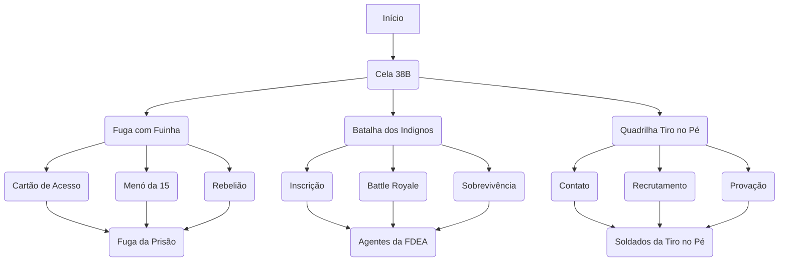

---
title:
draft: true
tags:
description:
aliases:
permalink:
---
**Para 3-4 personagens de nível 1**

# Início
O grupo inicia sendo levado para uma das celas do complexo 4 da Prisão Amaldiçoada da FDEA , as Forças de Defesa contra Energia Amaldiçoada. Esta seção da prisão é destinada para feiceiros de grau 4 e recém despertados na Energia Amaldiçoada.

## Espectros
- Espíritos Amaldiçoados modificados pela FDEA para auxiliarem no controle dos prisioneiros;
- Aparência de pequenos sinos com rostos humanos em repouso, com olhos e bocas fechados; 
- Principal uso: barreira nas portas das celas, limitando não só fisicamente mas aplicando um efeito de dreno de Energia Amaldiçoada nos prisioneiros, os impedindo de usarem seus poderes de forma plena.
## Carceceiros
- Guardas da prisão, grande maioria sendo feiticeiros de grau 4 e 3 da FDEA;
- Possuem um cartão de acesso que desativa o efeito dos espectros;
## Barreiras
- A prisão possui várias camadas de barreiras afim de aumentar a segurança;
- As barreiras são posicionadas com talismãs guardados por agentes mais poderosos que os Carcereiros;

# Cela 38B
- Chão e paredes de concreto maçiço, úmida e pegajosa;
- 2 Beliches, um mini banheiro e uma escrivaninha;
- A janela aberta dá de encontro com uma paisagem de um campo florido, com o vento batendo e o sol no alto. A visão é proveniente de uma barreira ilusória.

Ao chegarem, 3 dos 4 integrantes da cela recebem o grupo com calorosas boas-vindas.
- "Fazia tempo que não tínhamos sangue novo"
- "Vai ser bom pra gente aquecer pra Batalha de quarta"
- "A gente pode usar eles de escudo humano lá, o que acham?"
## Combate #1

Após o combate:
- Último integrante se apresenta como Fuinha;
- Elogia o grupo e diz que não interferiu pois se eles não tivessem ganhado dos inúteis não serviriam de nada;
- Conta de seu plano e do estado atual da prisão.

# Fuga com Fuinha
- Roubar um cartão de acesso de um dos guardas para desativar os espectros;
- Convencer o Menó da 15 a se aliar ao grupo: A técnica dele servirá para quebrar um ponto fraco em uma das barreiras;
- Com o cartão, abrir o máximo de celas possíveis e usar a oportunidade para escapar. 
# Batalha dos Indignos
- A Batalha ocorre todo fim do mês (daqui a 5 dias);
- Fase 1: Battle Royale entre os participantes, os 20 melhores ficam para a próxima fase;
- Fase 2: Sobreviver por 30 segundos a um Espírito Amaldiçoado;
- Os vencedores se tornam agentes da FDEA e compõem uma das equipes especiais de "kamikazes", usados em missões praticamente impossíveis e onde as baixas não são levadas em consideração.
# Quadrilha Tiro no Pé
- Crime organizado que comanda de dentro das prisões;
- A seção 4 é comandada por um dos majores da quadrilha;
- A quadrilha possui um acordo com a FDEA onde membros da quadrilha podem sair
- Membros da quadrilha possuem

