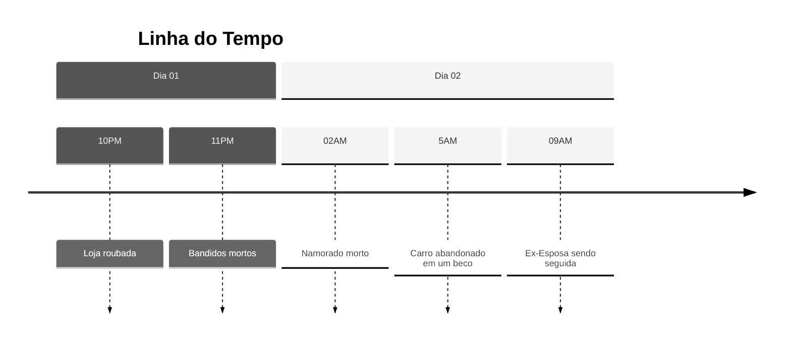

A atuação de Feiticeiros não se limita ao combate. Seja qual for o inimigo, Feiticeiro ou Maldição, todos sabem que a luta é o último recurso em uma situação de adversidade. Não há desonra em fugir, se esconder ou recrutar aliados, desde que isso seja em prol da sobrevivência. 
Para criar bons cenários de investigação e solução de mistérios é imprescindível ter ideia da linha do tempo, do alvo ou do crime e da quantidade de encontros que os jogadores irão enfrentar.
### Linha do Tempo de Acontecimentos

### Alvo e Objetivo Final

### 3 Pistas por Encontro

### Dificuldade
#### 3-4 Encontros: Fácil
#### 5-6 Encontros: Intermediário
#### 7-8 Encontros: Difícil
# Exemplo de Investigação: Assassinato

## Alvo
Um cidadão comum que despertou sua Técnica Inata de forma tardia, ao qual revelou seu lado mais sombrio e seus desejos mais íntimos. 

### Caraterísticas
Homem adulto na casa dos 40 anos. Branco, grisalho, cicatriz no nariz.

### Fatos
Ex-presidiário, possui 2 filhos e uma ex-exposa, que delimitou uma ordem de restrição contra ele. Possui Trabalha como taxista e está há alguns meses fora do crime oficialmente. O tempo de cadeia, longe dos filhos, brigas com a ex-exposa, tudo isso o tornou passivo de ser cativado a participar de um grupo de ladrões de banco. Em um dos roubos uma perseguição começa e ele desperta sua técnica, ao qual o permite acelerar o envelhecimento dos outros. Ele transforma os outros bandidos em velhos caquéticos, fica com todo o dinheiro e começa sua vingança contra a esposa. Seu primeiro alvo é o atual namorado dela.

### Linha do Tempo
**Início**: Namorado morto

### Pistas

#### Namorado Morto
Sem indícios de resistência/combate por parte do morto, encontrado na porta da casa. Resquícios de Energia Amaldiçoada no corpo;
- Marcas de Pneu no portão da casa;
- Anel de pedra preciosa próximo do corpo. Aparentemente caiu e ficou em um canto; 
- Porta-retrato com uma mulher e 2 crianças. A mulher veste um uniforme da maior loja de departamento da cidade.
#### Carro abandonado
Bolsas pretas, notas de dinheiro e joias espalhadas pelo carro;
- 2 corpos no porta-malas. Ambos vestindo balaclava e roupas pretas e discretas;
- Documentos de restrição judicial;
- Crachá de uma loja de joias.
#### Loja roubada
- Suspeito: Ex-funcionário do crachá encontrado;
- Descrição do ex-funcionário;
- Descrição do carro de fuga bate com o carro abandonado.
