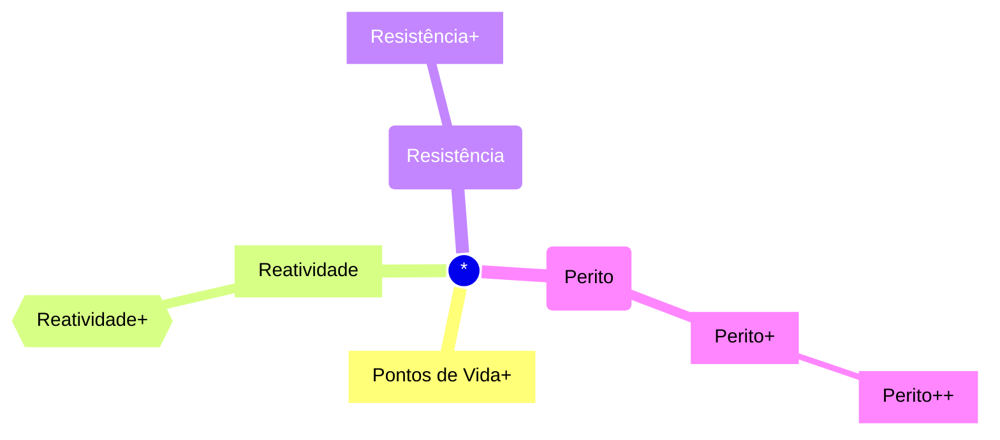

# Reatividade 
Você ganha 1 reação extra por turno. Esta reação extra não pode ser usada com a habilidade de Trocar Golpes.
## Reatividade+
Você ganha 2 reações extras por turno. Estas reações extras não podem ser usadas com a habilidade de Trocar Golpes.
# Pontos de Vida+
Você aumenta seu HP máximo em uma quantidade igual ao seu **nível atual X 2**. A cada nível que subir após isso, ganhe +2 de HP.
# Resistência
Escolha um dos atributos principais para ser proficiente em testes de resistência.
## Resistência+
Escolha um segundo atributo principal para ser proficiente em testes de resistência.
# Perito
Escolha duas perícias para ser proficiente.
## Perito+
Escolha mais duas perícias para ser proficiente.
## Perito++
Escolha mais duas perícias para ser proficiente.
