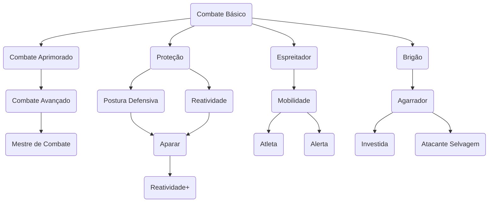

# Ataque Desarmado Aprimorado

## Nível 1 - Combate Básico
Seu dano de ataque desarmado aumenta para 1d6 de dano contundente.
## Nível 4 - Combate Intermediário
Seu dano de ataque desarmado aumenta para 1d8 de dano contundente.
## Nível 8 - Combate Avançado
Seu dano de ataque desarmado aumenta para 2d4 de dano contundente.
## Nível 12 - Mestre de Combate
Seu dano de ataque desarmado aumenta para 1d10 de dano contundente.
# Combate Corpo a Corpo Defensivo

## Nível 2 - Proteção 
Quando uma criatura que você pode ver ataca um aliado que não seja você e que esteja a até 1 unidade de você, você pode usar sua reação para trocar de lugar com o aliado, fazendo o ataque usar seu CA e o dano, em caso de sucesso, ser direcionado a você.
## Nível 4 - Aparar
Ao realizar a Reação de Esquiva contra um ataque corpo a corpo feito contra você, você pode adicionar +3 ao CA apenas para este ataque. Caso esteja usando uma arma com duas mãos, adicione +4.
## Nível 6 - Reatividade 
- Você pode usar 2 reações por rodada, desde que as habilidades de reação sejam as descritas neste talento.
## Nível 8 - Postura Defensiva
Por 1 ponto de Ação, você pode entrar em uma postura defensiva que dura até o início do seu próximo turno. Enquanto estiver em sua postura defensiva, Esquiva e Aparar não gastam sua reação.
## Nível 10 - Reatividade
- Você pode usar 3 reações por rodada, desde que as habilidades de reação sejam as descritas neste talento.
# Arruaceiro

## Nível 1 - Brigão
- Você é proficiente com armas improvisadas. Ao fazer rolagens de acerto, some 1d6.
- Quando você acerta uma criatura com um ataque desarmado ou uma arma improvisada em seu turno, você pode tentar agarrar o alvo por 1 ponto de Ação.
## Nível 4 - Resistente
Seus pontos de vida máximos aumentam em 6. Sempre que você subir de nível posteriormente, seus pontos de vida máximos aumentam em 2 pontos de vida adicionais.
## Nível 6 - Agarrador
Você pode usar sua ação para tentar imobilizar uma criatura que você esteja agarrando. Para fazer isso, faça outro teste de agarrar. Se você for bem-sucedido, você e a criatura ficam impedidos de se mover até o fim da imobilização.
## Nível 6 - Investida
Você adquire a ação de Investida. Por 3 pontos de Ação, se movimente até o dobro de seu deslocamento, podendo prosseguir com um ataque corpo a corpo. Se você mover pelo menos 2 unidades em linha reta imediatamente antes de atacar, você ganha um bônus de +4 na jogada de dano do ataque (se você escolheu fazer um ataque corpo a corpo e acertou) ou realiza a ação de Empurrar, com o alvo se deslocando até 2 unidades para longe de você em caso de sucesso.
## Nível 10 - Atacante Selvagem
Uma vez por turno, ao rolar o dano de um ataque corpo a corpo, você pode rolar novamente os dados de dano da arma e usar qualquer um dos totais.
# Ninja

## Nível 1 - Espreitador
- Você ganha proficiência em **Furtividade**.
- Você tem vantagem em rolagens de acerto caso o alvo tenha um aliado a até 1 unidade de distância dele. 
## Nível 4 - Mobilidade
Você é excepcionalmente rápido e ágil. Você recebe os seguintes benefícios:
- Seu deslocamento aumenta em 2 unidades.
- Você pode se mover por Terreno Difícil usando **Movimento Simples**.
- Criaturas que são alvos de seus ataques corpo a corpo não podem usar a Reação de **Esquiva** contra você.
## Nível 6 - Atleta
- Você pode se levantar da posição de **Caído** usando uma ação grátis;
- Você pode Escalar, Nadar e Saltar usando **Movimento Simples**. Caso seja necessário um teste para completar o movimento, você faz a rolagem com vantagem.
## Nível 8 - Alerta
- Você não pode ser surpreendido enquanto estiver consciente.
- Seu valor de iniciativa se torna **mod de Agilidade + mod de Ego**.
- Outras criaturas não têm vantagem em jogadas de ataque contra você por não serem vistas por você.