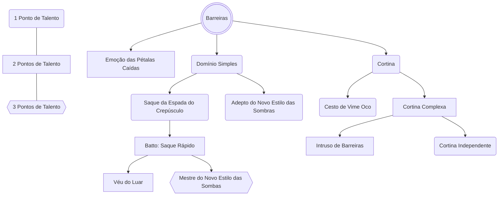

# Cortina
Você pode gastar 3 pontos de Energia para abrir uma cortina que cobre os céus e o solo em um raio de até 500 unidades de raio por 10 minutos. Ao ativar, uma substância escura e viscosa se derrama pelos céus, e a barreira exterior toma a forma de um domo (meia esfera). O dia se torna noite e os Espíritos Amaldiçoados tendem a sair de seus esconderijos, principalmente os de grau 4 a grau 2.
- A barreira da Cortina funciona como um isolante eletromagnético, impedindo a comunicação de celulares e outros dispositivos eletrônicos entre quem está dentro com quem está fora. 
- A cortina é imune a dano psíquico, possui seus pontos de EA máximos como pontos de vida, **8 + Mod de Alma + Mod de Ego** de CA e falha automaticamente qualquer salvaguarda. 
- Você pode gastar pontos extras na conjuração da Cortina para extender sua vida (+10HP por ponto extra) e sua duração (+1 min por ponto extra).
## Cesto de Vime Oco
Como Ação ou Reação contra o acerto garantido de um domínio, ou vendo um domínio sendo expandido, por 3 pontos de Energia, você envolve um espaço circular de 3 unidades de raio em volta de você por 2 turnos. Os acertos garantidos são anulados neste espaço e quaisquer criaturas a sua escolha dentro do espaço também são protegidas. A barreira não anula técnicas amaldiçoadas ou pessoas de entrarem, afetando apenas o acerto garantido. Você pode, após os 2 turnos terem passados, manter o cesto ativo por um número indeterminado de turnos com um selo que utiliza suas 2 mãos, não podendo utilizar nenhuma ação ou reação ofensiva enquanto este continuar ativo.
## Cortina Complexa
Você aprimorou suas cortinas com o uso, sendo capaz de adicionar votos vinculativos que alteram as propriedades dela. Ao conjurar uma cortina, adicione uma das propriedades abaixo:
- Saída Fácil: Você desativa as defasas interiores da barreira, permitindo que criaturas saiam de dentro da cortina sem problemas. O CA das defesas exteriores aumenta em +2 e o HP total é duplicado.
- Entrada Fácil: Você desativa as defasas exteriores da barreira, permitindo que criaturas entrem na cortina sem problemas. O CA das defesas interiores aumenta em +2 e o HP total é duplicado.
- Banimento: Você impedir completamente a passagem de uma única criatura pela barreira. Caso queira que a criatura fique dentro da barreira, você também não pode sair. Caso queira que a criatura fique do lado de fora da barreira, você também não pode entrar e deve se manter a até 10 unidades de uma das bordas da barreira.  
- Ocultação: **(Pré-requisito extra: Ocultação de Energia Amaldiçoada)** Você pode ocultar a barreira da cortina para criaturas externas. A aparência se assemelha a um espelho perfeito e toda Energia Amaldiçoada emitida internamente não é alertada para o exterior. Criaturas com o talento **Rastreador de Energia Amaldiçoada** podem fazer teste de Percepção ou detectar com Percepção Passiva. O DC em ambos os casos é um teste seu de **Furtividade + seu modificador de Ego**.
## Cortina Independente
Você aprendeu a criar Cortinas utilizando talismãs como catalisadores. Cortinas com talismãs custam 5 pontos de Energia e tomam 1 hora em forma de ritual para conjurá-la. A cortina dura até 12 horas ou até o talismã for destruído e tem até 2000 unidades de raio. Você escolhe um local para fixar o talismã, ao qual deve ser visível o suficiente em seus arredores. Caso o talismã for posicionado fora da barreira o CA das defesas exteriores aumenta em +3 e o HP total é triplicado, Caso o talismã for posicionado dentro da barreira o CA das defesas interiores aumenta em +3 e o HP total é triplicado.
## Intruso de Barreiras
Você consegue se esgueirar e invadir barreiras sem as quebrar:
- Enquanto fora de uma barreira, você pode fazer um teste de Ego contra o DC do feiticeiro que a conjurou. A falha o impossibilita de entrar na barreira sem a quebrar, já o sucesso o permite invadir a barreira sem a romper, ainda que o feiticeiro conjurador saberá que alguém a invadiu.
- Enquanto dentro de uma barreira, você pode fazer um teste de Ego contra o DC do feiticeiro que a conjurou para alterar suas propriedades. A falha o impossibilita de a modificar, já o sucesso o permite alterar seu tamanho, duração, criaturas permitidas a entrar e/ou sair ou quaisquer outras propriedades presentes nela.
# Domínio Simples
Como Ação ou Reação à uma rolagem de ataque ou teste que utilize Energia, feitiço ou expansão de domínio, você gasta 3 pontos de Energia para preencher seus entornos em um círculo de 3 unidades por 5 turnos. O círculo possui seu total de pontos de Energia como pontos de vida. Quaisquer técnicas que atingir você ou o círculo será redirecionada para a barreira do domínio simples, reduzindo seus pontos de vida até 0.
## Saque da Espada do Crepúsculo
Você assume uma postura baixa e preparada. Quando uma criatura entra na área do seu **Domínio Simples**, você pode realizar, como Reação e custando 1 ponto de Energia, um ataque com arma contra ela. Em caso de acerto, você causa **dano crítico**.
Alternativamente, você pode optar por receber **+3 na CA e nos testes contra ataques de Energia Amaldiçoada** até o início do seu próximo turno.
## Adepto do Novo Estilo das Sombras
- Você pode ativar seu Domínio Simples sem gastar sua reação. 
- Você pode alterar a forma de seu Domínio Simples: Ao conjurá-lo, escolha entre um círculo de 3 unidades de raio, um cone de 3 unidades de raio ou um retângulo de 3x4/2x5/1x6 unidades de tamanho. Você também não precisa mais conjurar o Domínio com você no centro.
## Batto: Saque Rápido
Você aprende a técnica mais rápida do Novo Estilo das Sombras.
Como Ação custando 5 pontos de Energia, enquanto estiver empunhando uma arma corpo a corpo, você pode realizar um ataque com arma contra um número de alvos igual ao seu modificador de Agilidade (à sua escolha), desde que estejam dentro de **do seu deslocamento**. Após os ataques, você termina seu turno atrás do alvo mais distante dentre eles.
Esse movimento **não provoca a Reação de Troca de Golpe**.
## Véu do Luar
Por 1 ponto de Energia, você pode imbuir sua arma ou ataque desarmado com o poder do seu Domínio Simples. Ao fazer isso, adicione seu modificador de Ego às jogadas de ataque **e** dano com essa arma até o início de seu turno seguinte. 
## Mestre do Novo Estilo das Sombras
- O tamanho de seu Domínio Simples aumenta para um círculo de 5 unidades de raio, um cone de 5 unidades de raio e 3x5/2x6/1x7 unidades como retângulo.
- Você pode ativar seu Domínio Simples por 2 pontos de Energia.
- Você também pode recriar partes quebradas de armas por 1 ponto de Energia.
# Emoção das Pétalas Caídas
Uma técnica exclusiva das famílias nobres de Feiticeiros. Você cobre todo seu corpo em Energia Amaldiçoada que contra ataca no exato momento que o acerto garantido de qualquer domínio entre na área de efeito. Como Ação ou Reação você gasta 7 pontos de Energia para impedir qualquer rolagem de ataque com sucesso automático ou teste com falha automática. A técnica dura 5 turnos e não funciona contra ataques de armas brancas.
Você também pode utilizar esta técnica ofensivamente, desde que tenha equipado uma arma branca. Como Ação custando 3 pontos de Energia, você se envolve em Energia Amaldiçoada por 5 turnos. No momento do acerto de algum ataque, você pode usar sua reação de Trocar Golpes com vantagem. Ao acertar, o dano é considerado crítico, o tipo do dano é energético e você roda 1 dado de dano extra. É necessário gastar 1 ponto de Energia a cada reação bem sucedida. Caso sua Energia Amaldiçoada possua dano elemental ela também altera o dano da Emoção das Pétalas Caídas.