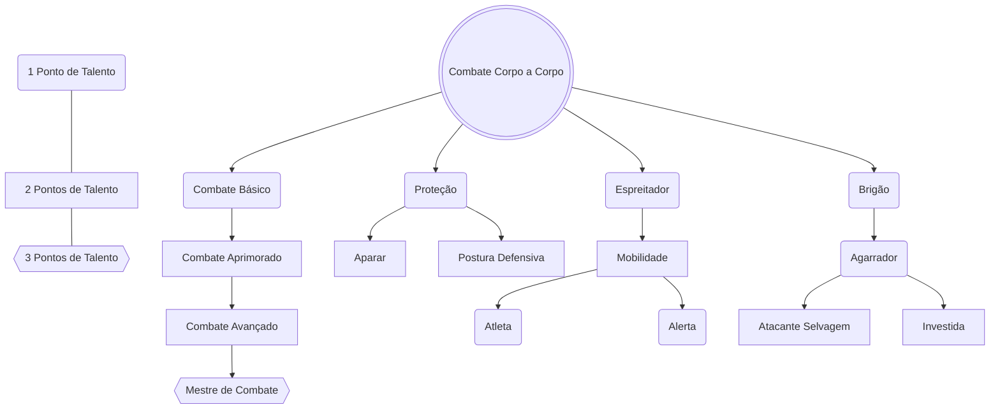

# Combate Básico
Você se torna proficiente em ataques desarmados, adicionando +1d6 nas rolagens de acerto. Seu dano de ataque desarmado aumenta para 1d6 de dano contundente.
## Combate Intermediário
Seu dano de ataque desarmado aumenta para 1d8 de dano contundente.
## Combate Avançado
Seu dano de ataque desarmado aumenta para 2d4 de dano contundente.
## Mestre de Combate
Seu dano de ataque desarmado aumenta para 1d10 de dano contundente.
# Proteção 
Quando uma criatura que você pode ver ataca um aliado que não seja você e que esteja a até 1 unidade de você, você pode usar sua reação para trocar de lugar com o aliado, fazendo o ataque usar seu CA e o dano, em caso de sucesso, ser direcionado a você.
## Postura Defensiva
Como Ação, você pode entrar em uma postura defensiva que dura até o início do seu próximo turno. Enquanto estiver em sua postura defensiva, Esquiva e Aparar não gastam sua reação.
## Aparar
Ao realizar a Reação de Esquiva contra um ataque corpo a corpo feito contra você, você pode adicionar +3 ao CA apenas para este ataque. Caso esteja usando uma arma de duas mãos, adicione +4.
# Brigão
- Você é proficiente com armas improvisadas. Ao fazer rolagens de acerto, some 1d6.
- Quando você acerta uma criatura com um ataque desarmado ou uma arma improvisada em seu turno, você pode tentar agarrar o alvo com sua reação.
## Agarrador
Você pode usar sua ação para tentar imobilizar uma criatura que você esteja agarrando. Para fazer isso, faça outro teste de agarrar. Se você for bem-sucedido, você e a criatura ficam impedidos de se mover até o fim da imobilização.
## Investida
Você adquire a ação de Investida. Por 3 pontos de Ação, se movimente até o dobro de seu deslocamento, podendo prosseguir com um ataque corpo a corpo. Se você mover pelo menos 2 unidades em linha reta imediatamente antes de atacar, você ganha um bônus de +4 na jogada de dano do ataque (se você escolheu fazer um ataque corpo a corpo e acertou) ou realiza a ação de Empurrar, com o alvo se deslocando até 2 unidades para longe de você em caso de sucesso.
## Atacante Selvagem
Uma vez por turno, ao rolar o dano de um ataque corpo a corpo, você pode rolar novamente os dados de dano da arma e usar qualquer um dos totais.
# Espreitador
- Você ganha proficiência em **Furtividade**.
- Você tem vantagem em rolagens de acerto caso o alvo tenha um aliado a até 1 unidade de distância dele. 
## Mobilidade
- Seu deslocamento aumenta em 2 unidades.
- Você pode se mover por Terreno Difícil usando **Movimento Simples**.
- Criaturas que são alvos de seus ataques corpo a corpo não podem usar a Reação de **Esquiva** contra você.
## Atleta
- Você pode se levantar da posição de **Caído** usando uma ação grátis;
- Você pode Escalar, Nadar e Saltar usando **Movimento Simples**. Caso seja necessário um teste para completar o movimento, você faz a rolagem com vantagem.
## Alerta
- Você não pode ser surpreendido enquanto estiver consciente.
- Outras criaturas não têm vantagem em jogadas de ataque contra você quando estiverem com a condição de **Oculto**.