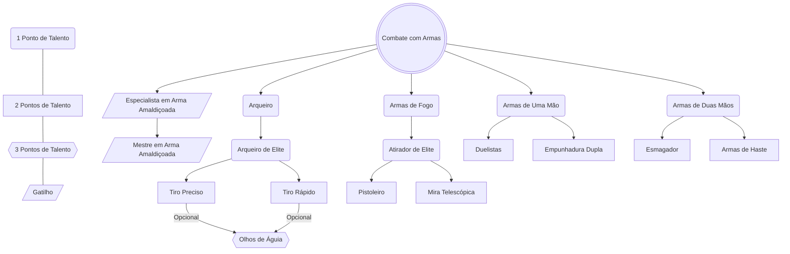

# Armas de Uma Mão
Você ganha proficiência com Armas de de Uma Mão. Ao fazer rolagens de acerto, some 1d6.
## Duelista
Quando você estiver empunhando uma arma corpo a corpo em uma das mãos e nenhuma outra arma, você recebe um bônus de +2 nas rolagens de dano com essa arma.
## Empunhadura Dupla
Você domina o combate com duas armas, obtendo os seguintes benefícios:
- Você recebe um bônus de +1 na CA enquanto estiver empunhando uma arma corpo a corpo diferente em cada mão.
- Ao atacar com uma arma, você pode fazer um ataque extra com a arma da outra mão, desde que esta possua a propriedade Leve e seja corpo a corpo. Este ataque extra é realizado com uma penalidade de -2 na rolagem de acerto.
- Você pode sacar ou guardar duas armas de uma mão quando normalmente só poderia sacar ou guardar uma.
# Armas de Duas Mãos
Você ganha proficiência com Armas de de Duas Mãos. Ao fazer rolagens de acerto, some 1d6.
## Esmagador
Você é experiente na arte de esmagar seus inimigos, o que lhe concede os seguintes benefícios:
- Uma vez por turno, quando você acerta uma criatura com um ataque que causa dano contundente, você pode movê-la 1 unidade para um espaço desocupado.
- Quando você acerta um golpe crítico com armas que causam dano contundente a uma criatura, as jogadas de ataque contra essa criatura são feitas com vantagem até o início do seu próximo turno.
- Antes de realizar um ataque corpo a corpo com uma arma de duas mãos, você pode optar por sofrer uma penalidade de -5 na jogada de acerto. Se o ataque acertar, você adiciona 1d12 ao dano do ataque.
## Armas de Haste
- Quando você ataca com uma arma com a propriedade **Extensão**, você pode tentar fazer um segundo ataque em outra criatura a até 2 unidades de distância. Faça a rolagem de acerto com uma penalidade de -5.
- Criaturas não podem revidar seus ataques de armas com a propriedade **Extensão** com **Trocar Golpes**.
# Armas de Fogo
- Você ganha proficiência com Armas de Fogo. Ao fazer rolagens de acerto, some 1d6.
- Você pode recarregar armas de fogo usando sua reação.
## Atirador de Elite
- Estar a 1 unidade de uma criatura hostil não impõe desvantagem em suas jogadas de ataque à distância com armas de fogo.
- Seus ataques com armas de fogo ignoram **Meia Cobertura**.
## Pistoleiro
Caso esteja portando duas pistolas ou revólveres, você pode realizar um ataque com cada como parte de sua ação de ataque. Caso escolha isso, faça a segunda rolagem de acerto com uma penalidade de -5.
## Mira Telescópica
- O alcance de todas as armas de fogo é dobrado.
- Seus ataques com armas de fogo ignoram **Cobertura Total**.
# Arqueiro
- Você ganha proficiência com Arcos. Ao fazer rolagens de acerto, some 1d6.
- Estar a 1 unidade de uma criatura hostil não impõe desvantagem em suas jogadas de ataque à distância com arcos.
## Arqueiro de Elite
- Você ganha +1 em rolagens de acerto em ataques de arco.
- Armas com a propriedade **Silencioso** agora não corroboram para você perder sua condição de **Oculto** mesmo quando você erra um ataque.
## Olhos de Águia
- Você ganha +1 em rolagens de acerto em ataques de arco.
- O alcance de todos os arcos é dobrado.
## Tiro Preciso
Você pode usar sua reação para mirar nos pontos fracos do oponente. Ao fazer isso, aumente o alcance de crítico do próximo disparo de arco feito neste turno em 1d4.
## Tiro Rápido
Você pode realizar dois ataques com arco como parte de sua ação de ataque. Caso escolha isso, faça a segunda rolagem de acerto com uma penalidade de -5.
# Especialista em Arma Amaldiçoada
Você praticou extensivamente o uso de uma arma amaldiçoada de sua escolha, se especializando em seu uso. Caso a arma não possua técnica imbuída nela, você mantém sua perícia superior em replicatas dela. Ao usar a arma você recebe os seguintes benefícios:
- Adicione seu modificador de Ego em todas as rolagens de acerto com a arma escolhida.
# Mestre em Arma Amaldiçoada
Você praticou extensivamente o uso de uma arma amaldiçoada de sua escolha, obtendo sua masterização completa. Caso a arma não possua técnica imbuída nela, você mantém sua perícia superior em replicatas dela. Ao usar a arma você recebe os seguintes benefícios:
- Adicione seu modificador de Ego em todas as rolagens de dano com a arma escolhida.