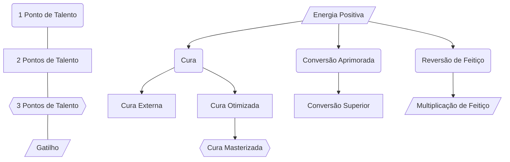

# Energia Positiva
**Pré-requisitos**: Gatilho.
Em um momento de torpor e de risco de morte você entende o processo de transformar Energia Amaldiçoada em energia positiva ao multiplicar negativo com negativo.
Com isso, você pode usar a Energia Positiva de forma ofensiva. Você pode adicionar dano radiante em seus ataques desarmado contra Espíritos Amaldiçoados. Cada ponto de Energia utilizado adiciona 1d8 de dano radiante ao ataque, os pontos são subtraídos do total de pontos de Energia que você pode gastar com cura e a quantidade de pontos de Energia que você pode gastar por ataque é determinada pelo seu Mod de Mente (Mínimo de 1).
# Cura
O uso básico de Energia Positiva consiste em curar seus próprios ferimentos. Com uma ação você usa X pontos de Energia para transformá-los em Xd6 de dados de vida. Você também pode curar ferimentos físicos graves (como membros quebrados/decepados) por 5 pontos de Energia.
A quantidade de pontos de Energia que você pode gastar por descanso é determinada pelo seu **nível atual X 2** (arredondado para baixo).
## Cura Externa
Você foi além da cura pessoal, conseguindo utilizar Energia Positiva em terceiros.
## Cura Otimizada
Você otimizou a conversão de Energia Amaldiçoada em Energia Positiva. Os dados de vida de cura se tornam Xd8.
## Cura Masterizada
Você otimizou a conversão de Energia Amaldiçoada em Energia Positiva. Os dados de vida de cura se tornam Xd10.
# Conversão Aprimorada
Com o uso exaustivo você alcançou um entendimento aguçado da Energia Positiva. A quantidade de pontos de Energia que você pode gastar com Cura por descanso se torna **nível atual X 3** (arredondado para baixo).
## Conversão Superior
A Energia Positiva se torna parte de sua essência, algo tão natural como respirar. A quantidade de pontos de Energia que você pode gastar com Cura por descanso se torna **nível atual X 4** (arredondado para baixo).
# Reversão de Feitiço
**Pré-requisitos**: Técnica Inata.

Você imbui sua técnica amaldiçoada com Energia Positiva, resultando em um efeito completamente oposto do habitual. O efeito pode ser transformar vantagens em desvantagens e vice-versa, tipo de dano oposto (Fogo em Gelo, Necrótico em Radiante) ou outro efeito a acordar com o Mestre.  Caso seu Caminho de Feiticeiro garanta este Talento e descreva um efeito diferente para a reversão, considere apenas este efeito. 
##  Multiplicação de Energia Negativa e Positiva
**Pré-requisitos**: Técnica Inata; Gatilho.

Energia Negativa, Energia Positiva. Você rompeu os limites destes conceitos, tornando o improvável em algo possível. Ao utilizar uma habilidade de sua Técnica Inata, você pode gastar o dobro de pontos de EA para causar tanto os efeitos padrões quanto os efeitos da reversão de feitiço. Caso seu Caminho de Feiticeiro garanta este Talento e descreva um efeito diferente para a multiplicação, considere apenas este efeito. 
