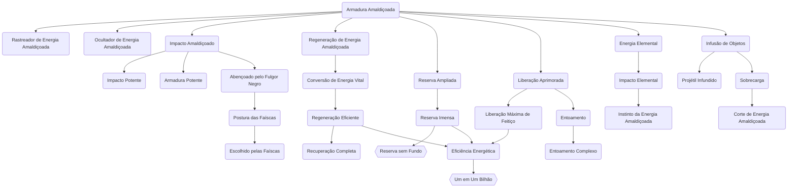

# Regeneração de Energia Amaldiçoada

## Nível 1 - Regeneração de Energia Amaldiçoada

Você amplia sua capacidade de recuperar Energia Amaldiçoada no meio do combate. Por 1 ponto de Ação, recupere 1d4 de pontos de Energia. Você também pode 2 pontos de Ação para recuperar o valor máximo atual. O dado de recuperação é aumentado nos níveis abaixo:

| Nível | Dado |
| ----- | ---- |
| 1     | 1d4  |
| 4     | 1d6  |
| 6     | 1d8  |
| 8     | 1d10 |
| 10    | 1d12 |
## Nível 2 - Conversão de Energia Vital

As situações de desespero lhe trouxeram a capacidade de transformar sua vitalidade em energia amaldiçoada. Uma vez por descanso, caso esteja com 1 ponto ou menos de EA você pode usar sua ação bônus para transformar 10HP em 1 ponto de EA. Você pode gastar quantos HP quiser, desde que não fique com menos de 1HP. 
## Nível 8 - Otimização de Energia Amaldiçoada

Você otimiza sua regeneração de Energia Amaldiçoada. Sempre que recuperar Energia Amaldiçoada usando pontos de Ação, some seu Mod de Mente no valor (mínimo de 1).
## Nível 10 - Estocagem de Energia Amaldiçoada

Sua regeneração de Energia Amaldiçoada atinge o auge, permitindo você recuperar totalmente sua Energia Amaldiçoada com 3 pontos de Ação. Esta habilidade é limitada a uma vez por descanso.
# Reservas de Energia Amaldiçoada
## Nível 1 - Energia Amaldiçoada Ampliada

Sua reserva de Energia Amaldiçoada é ampliada. Seu total de Energia Amaldiçoada se torna **(Nível x 2) + (Mod Alma X 2)**. Caso seu Mod de Alma seja inferior a 1, considere o modificador como +1.
## Nível 6 - Energia Amaldiçoada Imensa

Sua Energia Amaldiçoada tem reservas massivas, te tornando numa usina de Energia Amaldiçoada. Seu total de Energia Amaldiçoada se torna **(Nível x 3) + (Mod Alma X 2)**. Caso seu Mod de Alma seja inferior a 1, considere o modificador como +1.
## Nível 10 - Energia Amaldiçoada Sem Fundo
**Pré-requisitos**: Gatilho.

Você encontrou o núcleo de funcionamento da energia amaldiçoada e a energia oculta de você. Seu total de Energia Amaldiçoada se torna **(Nível x 3) + (Mod Alma X 4)**. Caso seu Mod de Alma seja inferior a 1, considere o modificador como +1.

# Liberação de Energia Amaldiçoada
## Nível 2 - Liberação Aprimorada

Você melhorou sua liberação total de EA, resultando num aumento considerável de poder. Você pode gastar 2 pontos de Ação para ativar os seguintes benefícios, que ficam ativos em troca de 2 pontos de Energia por turno:
- Você pode aumentar o dano de um ataque igual ao seu **Mod de Ego X 2** uma vez por turno;
- Seu CA aumenta em +1;
- Se você possuir o talento **Corte de Energia Amaldiçoada** seu alcance aumenta de 3 unidades em cone para 6 unidades em cone/9 unidades em linha reta para 12 unidades em linha reta e o dano contra objetos e estruturas é dobrado.
## Nível 6 - Liberação Máxima de Técnica

Você aprende como utilizar a liberação máxima de EA com sua técnica. Por 1 ponto de Ação você pode gastar o dobro de pontos de Energia para amplificar sua liberação de EA em uma de suas técnicas, adquirindo um dos seguintes benefícios na próxima vez que ela é conjurada:
- Alcance aumentado em 1,5X, arredondado para cima. Por exemplo, uma técnica com alcance de 2 unidades se torna uma técnica com alcance de 3 unidades. Este aprimoramento não funciona com técnicas baseadas em toque físico.
- A quantia de dados de dano é aumentada em 1,5X, arredondado para cima. Uma técnica de 4d4 de dano se torna uma técnica de 6d4 de dano.
- O bônus de acerto da técnica é aumentado em 1,5X, arredondado para cima. Uma técnica com +2 no acerto se torna uma técnica de +3 no acerto. DCs são aumentados em +2.
- A duração da técnica é aumentada em 1,5X, arredondado para cima. Uma técnica que dura 5 turnos se torna uma técnica que dura 8 turnos.
## Nível 8 - Entoamento

Você pode definir um ritual para uma técnica amaldiçoada de seu arsenal. O ritual inclui entoamento vocal e sinais semânticos e custa 3 pontos de Ação, funcionando como um feitiço de concentração que deve ser mantido em concentração no mínimo até o próximo turno, com cada turno subsequente amplificando o entoamento. Caso utilize a técnica em até 2 turnos após o fim do entoamento, ela receberá uma quantidade de benefícios da lista abaixo equivalente a quantidade de turnos entoando X 2 (com o limite sendo 1 + Mod Ego):
- Ignorar resistências e tratar imunidades como resistência;
- Vantagem na rolagem de ataque ou desvantagem na salvaguarda;
- Dobro de dados de dano;
- Alcance dobrado;
- Alvos dobrados;
- Duração dobrada;
- Ignora coberturas;
Caso a técnica beneficiada pelo entoamento envolva mais de uma rolagem de ataque ou salvaguarda, apenas uma das rolagens a escolha do jogador será afetada pelo entoamento, necessitando de mais de um benefício de "Vantagem na rolagem de ataque ou desvantagem na salvaguarda;" para cada rolagem extra a ser modificada. Você não pode utilizar a Liberação Máxima na técnica alvo do entoamento ou Expansão de Domínio enquanto estiver entoando.
## Nível 10 - Entoamento Complexo

Você extendeu seu conhecimento acerca de entoamentos. Sua lista de benefícios possíveis para a técnica alvo do entoamento ganha novas propriedades:
- Alcance triplicado (Necessário escolher o bônus de Alcance dobrado);
- Duração triplicada (Necessário escolher o bônus de Duração dobrada);
- Alvos triplicados (Necessário escolher o bônus de Alvos dobrados);
- Custo de EA cortado pela metade;
- Custo de ação diminuído em 1. Caso a técnica seja uma Reação você ganha uma reação extra exclusiva para a técnica alvo;
Agora você também é capaz de realizar um Entoamento Complexo, ao qual custa um turno inteiro para entoar, mas garantindo 4 benefícios. Entoamentos Complexos também podem ser extendidos para mais de um turno, com cada turno subsequente garantindo mais 4 benefícios e 1,5X de dano, com um limite de 3 turnos (2x de dano e 12 benefícios).
# Personalidade da Energia Amaldiçoada
## Nível 1 - Energia Amaldiçoada Elemental

Sua Energia Amaldiçoada adquire uma característica própria. Escolha um tipo de dano, e agora sempre que causar dano utilizando energia amaldiçoada você poderá causar este tipo de dano em vez disso.
## Nível 4 - Ocultador de Energia Amaldiçoada

Você adquire proficiência em Furtividade envolvendo Energia Amaldiçoada.
Sabendo o quão fácil é rastrear Energia Amaldiçoada, você se aperfeiçoou na ocultação de seus próprios resquícios de Energia Amaldiçoada. Ao ocultar sua Energia Amaldiçoada, você só pode ser rastreado por indivíduos com o talento "Rastreador de Energia Amaldiçoada", desde que este passe num teste contra seu valor do teste de Furtividade + seu modificador de Ego.
## Nível 6 - Energia Amaldiçoada Elemental Masterizada

O traço de sua Energia Amaldiçoada evolui, ganhando um efeito especial a depender do tipo de dano que pode ser ativado por 1 ponto de EA. O efeito não é acumulativo e dura 3 turnos.

- Ácido: Salvaguarda de COR, reduz CA em 1
- Alma: Salvaguarda de EGO, desvantagem em testes e salvaguardas de EGO
- Contundente: Ignora resistência
- Gelo, Salvaguarda de COR, reduz movimento pela metade
- Fogo: O próximo ataque de dano de fogo dá 1d4 de dano de fogo extra
- Energético: Salvaguarda de COR, empurra o alvo em 2 unidades
- Elétrico: Salvaguarda de COR, desativa reações
- Necrótico: Salvaguarda de COR, desvantagem em testes e salvaguardas de COR
- Perfurante: Ignora resistência
- Venenoso: Salvaguarda de COR, desvantagem em ataques corpo a corpo 
- Psíquico: Salvaguarda de MEN, ações bônus custam 1 ação
- Radiante: Salvaguarda de MEN, desvantagem em ataques de distância acima de 1 unidade
- Cortante: Ignora resistência
## Nível 10 - Instinto da Energia Amaldiçoada
**Pré-requisitos**: Gatilho.

Você aprendeu a usar sua Energia Amaldiçoada de um modo que ela reflete o instinto da sua alma. Por 1 ponto de Ação e 3 pontos de Energia, logo após um ataque que você libera sua Energia Amaldiçoada o alvo do ataque faz um teste de resistência. A falha resulta no alvo adquirir a condição de acordo com a intenção por 5 turnos. No começo do turno o alvo tenta o teste novamente, se tornando imune ao efeito por 24 horas com um sucesso. Escolha o instinto da sua Energia Amaldiçoada de acordo com a lista abaixo:
- Instinto Assassino: Condição de Amedrontado. Teste de Resistência de Mente de **DC 10 + Mod Ego**;
- Instinto Manipulador: Condição de Encantado. Teste de Resistência Mente de **DC 10 + Mod Ego**;
- Instinto Apodrecido: Condição de Envenenado. Teste de Resistência de Corpo de **DC 10 + Mod Ego**;
- Instinto Depravado: Condição de Cego. Teste de Resistência de Mente de **DC 10 + Mod Ego**;
- Instinto Instável: Condição de Atordoado. Teste de Resistência de Mente de **DC 10 + Mod Ego**.
# Fortalecimento de Objetos

## Nível 1 - Infusão Simples

Você consegue infundir sua EA em qualquer objeto, desde que este não possua EA própria (Ferramentas Amaldiçoadas e Objetos Reencarnados). Ao fazê-lo o objeto adquire as seguintes características por 5 turnos:
- O objeto se torna uma arma improvisada com o dobro de pontos de vida que tinha anteriormente;
- Você pode gastar o dobro de pontos de Energia para torná-lo volátil. O objeto é altamente reativo, causando efeitos diferentes de acordo com seu tamanho quando alguma criatura interaje com ele;
- Você pode gastar o dobro de pontos de Energia para fazê-lo flutuar a até 5 unidades do chão. Um objeto flutuante possui peso desprezível e se mantém no lugar até ser movido por alguma força externa;

| Tamanho    | Custo de Ação     | Custo de Energia | Efeito de Volatilidade    |
| ---------- | ----------------- | :--------------: | ------------------------- |
| Minúsculo  | 0                 |        0         | -                         |
| Pequeno    | 1                 |        1         | Terreno Obscurecido (1x1) |
| Médio      | 2                 |        2         | Terreno Obscurecido (2x2) |
| Grande     | 3                 |        4         | 4d6 de Dano Energético    |
| Enorme     | 2 Turnos Inteiros |        8         | 8d6 de Dano Energético    |
| Gigantesco | 4 Turnos Inteiros |        16        | 16d6 de Dano Energético   |

## Nível 2 - Projétil Infundido

Você tem a capacidade de infundir Energia em projéteis, como flechas, virotes, balas, em armas com a característica "Arremessar" e em objetos improvisados. Você pode imbuir um número de munições igual ao seu mod de Mente, transformando-as em Projéteis Amaldiçoados, que também adicionam seu Mod de Alma no dano final. Ao usar esses Projéteis Amaldiçoados, você realiza Ataques de Energia Amaldiçoada à distância em vez dos ataques normais que você usaria com eles, e controla sua trajetória enquanto estiverem no ar, fazendo com que os ataques com eles ignorem cobertura. Além disso, eles permanecerão flutuando no ar por 3 turnos, permitindo que você continue realizando ataques com eles mesmo após serem disparados, até que atinjam um objeto sólido ou alvo, quando então perdem essa propriedade. Você só pode controlar um número de munições dessa forma simultaneamente igual ao seu Mod de Mente (Mínimo de 1). Uma criatura dentro do alcance pode atacar seus Projéteis Amaldiçoados para destruí-los; eles têm 1 ponto de vida e CA 10.
## Nível 6 - Arma Melhorada

Adicione seu Mod de Alma em rolagens de dano com armas que você é proficiente. Caso a rolagem de ataque seja 1 natural, você deve fazer um teste com DC de 15 que resulta na arma sendo estilhaçada pela sobrecarga de Energia Amaldiçoada em uma falha. Ambos os efeitos são desconsiderados em ferramentas de Grau Especial.
## Nível 8 - Corte de Energia Amaldiçoada

Por 2 pontos de Ação ao estar com uma arma que você é proficiente equipada e que dê dano cortante, você pode gastar 5 pontos de Energia para liberar um potente corte fortalecido. Todas as criaturas em um cone de 3 unidades ou em uma linha reta de 6 unidades fazem salvaguardas de Agilidade de DC 10 + Mod Ego. Na falha, eles recebem o dano da arma + 2 dados de dano da arma de dano energético. O sucesso garante metade do dano total.
# Refinamento da Energia Amaldiçoada

## Nível 1 - Rastreador de Energia Amaldiçoada

Você adquire proficiência em Percepção envolvendo Energia Amaldiçoada.
Você se aperfeiçoou na detecção de resquícios de Energia Amaldiçoada. Caso faça um teste de Percepção para detectar estes resquícios, em caso de sucesso você saberá exatamente de quem é a Energia caso conheça o indivíduo. Você também pode seguir os rastros (DC = 8 + Mente da Criatura + Ego da Criatura). 
## Nível 6 - Eficiência Energética

Seu refinamento de EA chega a um novo patamar, o que te permite usar técnicas com a mesma potência de antes mas usando menos energia. Todas as técnicas que utilizam Energia Amaldiçoada tem seu custo reduzido em 1 (mínimo de 1).
## Nível 10 - Um em Um Bilhão
**Pré-requisitos**: Gatilho.

Você é um ser especial e sua manipulação de Energia Amaldiçoada está entre as melhores da história. Todas as técnicas que utilizam Energia Amaldiçoada tem seu custo reduzido em 1 (mínimo de 1), acumulativo com o custo reduzido de "Eficiência Energética". Escolha uma técnica em específico para reduzir seu custo a 0. Caso a técnica envolva um gasto de Energia Amaldiçoada variável, o gasto 0 valerá apenas para o uso mínimo de Energia Amaldiçoada da técnica.

# Fulgor Negro
## Nível 4 - Abençoado pelo Fulgor Negro

O Fulgor Negro te abençoou. Ao acertar um crítico o alcance de seu d20 de Fulgor Negro desce para 18-20. Este bônus acumula com os gatilhos "Fulgor Repetitivo" e "A Zona".
## Nível 6 - Postura das Faíscas
Por 1 ponto de Ação, você se agacha, posicionando o punho sobre a palma da outra mão. Seu próximo ataque permite que você role para Fulgor Negro mesmo que não seja um acerto crítico.
## Nível 10 - Escolhido pelas Faíscas
**Pré-requisitos**: Gatilho.

Ao rolar para Fulgor Negro após um acerto crítico ou ao usar Postura das Faíscas, troque o d20 por um d6 com 6 sendo sucesso.
# Combate com Energia Amaldiçoada

## Nível 1 - Impacto Amaldiçoado

Você pode reforçar seu ataque desarmado com pontos de EA. O dado de dano aumenta com o nível, e você pode adicionar o dano após o acerto ter sido garantido, inclusive em casos de crítico e de Fulgor Negro.

| Nível | Dado | Custo de Energia |
| ----- | ---- | ---------------- |
| 1     | 1d6  | 1                |
| 3     | 1d8  | 2                |
| 5     | 1d10 | 3                |
| 7     | 2d6  | 4                |
| 9     | 2d8  | 5                |
| 11    | 2d10 | 6                |

## Nível 1 - Armadura Amaldiçoada

Você pode reforçar seu corpo com pontos de EA para o próximo ataque. Como uma reação, você escolhe uma quantia de pontos de EA para diminuir o dano. O dado é determinado pelo nível:

| Nível | Dado | Custo de Energia |
| ----- | ---- | ---------------- |
| 1     | 1d6  | 1                |
| 3     | 1d8  | 2                |
| 5     | 1d10 | 3                |
| 7     | 2d6  | 4                |
| 9     | 2d8  | 5                |
| 11    | 2d10 | 6                |
## Nível 6 - Barragem de Golpes

Você pode gastar 3 pontos de Energia para realizar 2 ataques desarmados ou 1 ataque de arma como parte de sua ação de ataque.
## Nível 8 - Impacto/Armadura Potente
Ao usar as habilidades **Impacto Amaldiçoado** e **Armadura Amaldiçoada**, some seu **mod de Alma** no total.
