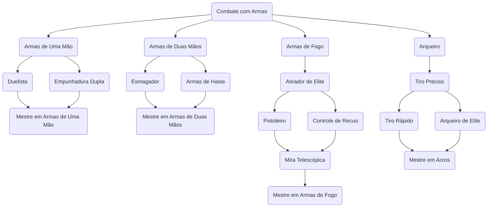

# Mestre em Armas de Uma Mão

## Nível 1 - Armas de Uma Mão
- Você ganha proficiência com Armas de de Uma Mão. Ao fazer rolagens de acerto, some 1d6.
## Nível 4 - Duelista
Quando você estiver empunhando uma arma corpo a corpo em uma das mãos e nenhuma outra arma, você recebe um bônus de +2 nas jogadas de dano com essa arma.
## Nível 6 - Empunhadura Dupla
Você domina o combate com duas armas, obtendo os seguintes benefícios:
- Você recebe um bônus de +1 na CA enquanto estiver empunhando uma arma corpo a corpo diferente em cada mão.
- Você pode usar o combate com duas armas mesmo quando as armas corpo a corpo de uma mão que você estiver empunhando não forem leves.
- Você pode sacar ou guardar duas armas de uma mão quando normalmente só poderia sacar ou guardar uma.
## Nível 8 - Especialista em Arma Amaldiçoada
Você praticou extensivamente o uso de uma arma amaldiçoada de sua escolha, obtendo sua masterização. Caso a arma não possua técnica imbuída nela, você mantém sua perícia superior em replicatas dela. Ao usar a arma você recebe os seguintes benefícios:
- Adicione seu modificador de Ego em todas as rolagens de dano com a arma escolhida.
# Mestre em Armas de Duas Mãos

## Nível 1 - Proficiência em Armas de Duas Mãos
- Você ganha proficiência com Armas de de Duas Mãos. Ao fazer rolagens de acerto, some 1d6.
## Nível 4 - Esmagador
Você é experiente na arte de esmagar seus inimigos, o que lhe concede os seguintes benefícios:
- Uma vez por turno, quando você acerta uma criatura com um ataque que causa dano contundente, você pode movê-la 1 unidade para um espaço desocupado.
- Quando você acerta um golpe crítico que causa dano de concussão a uma criatura, as jogadas de ataque contra essa criatura são feitas com vantagem até o início do seu próximo turno.
- Antes de realizar um ataque corpo a corpo com uma arma de duas mãos, você pode optar por sofrer uma penalidade de -1d4 na jogada de acerto. Se o ataque acertar, você adiciona +1d8 ao dano do ataque.
## Nível 6 - Mestre em Armas de Haste
- Quando você ataca com uma arma com a propriedade **Extensão**, você pode usar 1 ponto de Ação para tentar fazer um segundo ataque em outra criatura a até 2 unidades de distância. Faça a rolagem de acerto com desvantagem.
- Criaturas não podem revidar seus ataques de armas com a propriedade **Extensão** com **Trocar Golpes**.
## Nível 8 - Especialista em Arma Amaldiçoada
Você praticou extensivamente o uso de uma arma amaldiçoada de sua escolha, obtendo sua masterização. Caso a arma não possua técnica imbuída nela, você mantém sua perícia superior em replicatas dela. Ao usar a arma você recebe os seguintes benefícios:
- Adicione seu modificador de Ego em todas as rolagens de dano com a arma escolhida.
# Mestre em Armas de Fogo
## Nível 1 - Atirador
- Você ganha proficiência com Armas de Fogo. Ao fazer rolagens de acerto, some 1d6.
- Você pode recarregar armas de fogo usando uma ação grátis.
## Nível 4 - Atirador de Elite
- Estar a 1 unidade de uma criatura hostil não impõe desvantagem em suas jogadas de ataque à distância com armas de fogo.
- Seus ataques com armas de fogo ignoram **Meia Cobertura**.
## Nível 6 - Pistoleiro
- Caso esteja portando duas pistolas ou revólveres, você pode realizar um ataque com cada como parte de sua ação de ataque. Caso escolha isso, faça as jogadas de acerto com -2.
## Nível 8 - Especialista em Arma Amaldiçoada
Você praticou extensivamente o uso de uma arma amaldiçoada de sua escolha, obtendo sua masterização. Caso a arma não possua técnica imbuída nela, você mantém sua perícia superior em replicatas dela. Ao usar a arma você recebe os seguintes benefícios:
- Adicione seu modificador de Ego em todas as rolagens de dano com a arma escolhida.
## Nível 10 - Mira Telescópica
- O alcance de todas as armas de fogo é dobrado.
- Seus ataques com armas de fogo ignoram **Cobertura Total**.
# Mestre em Arcos
## Nível 1 - Arqueiro
- Você ganha proficiência com Arcos. Ao fazer rolagens de acerto, some 1d6.
- Estar a 1 unidade de uma criatura hostil não impõe desvantagem em suas jogadas de ataque à distância com arcos.
## Nível 4 - Tiro Preciso
- Você ganha +1 em rolagens de acerto em ataques de arco.
- Você pode usar 1 ponto de Ação para mirar nos pontos fracos do oponente. Ao fazer isso, aumente o alcance de crítico do próximo disparo de arco feito neste turno em 1d4.
## Nível 6 - Tiro Rápido
- Você pode realizar dois ataques com arco como parte de sua ação de ataque. Caso escolha isso, faça as jogadas de acerto com -2.
 - Armas com a propriedade **Silencioso** agora não corroboram para você perder sua condição de **Oculto** mesmo quando você erra um ataque.
## Nível 8 - Especialista em Arma Amaldiçoada
Você praticou extensivamente o uso de uma arma amaldiçoada de sua escolha, obtendo sua masterização. Caso a arma não possua técnica imbuída nela, você mantém sua perícia superior em replicatas dela. Ao usar a arma você recebe os seguintes benefícios:
- Adicione seu modificador de Ego em todas as rolagens de dano com a arma escolhida.
## Nível 10 - Arqueiro de Elite
- Você ganha +1 em rolagens de acerto em ataques de arco.
- O alcance de todos os arcos é dobrado.