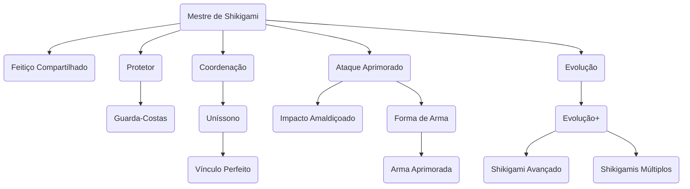

# Mestre de Shikigami

Feiticeiros possuem a capacidade de solidificar sua Energia Amaldiçoada em um Shikigami, um ser vivo constituído da Energia Amaldiçoada do usuário, que determina sua aparência. Os shikigamis são pacíficos com o usuário e seus aliados, não podem ser Encantados, e funcionam como criaturas próprias ao qual o usuário comanda.
## Nível 1 - Conjurar Shikigami

Por 2 pontos de Ação, você pode invocar o shikigami que está vinculado a você. Ele aparece em um espaço desocupado à sua escolha, a até 5 unidades de você.
Em combate, o shikigami compartilha sua contagem de iniciativa, mas realiza seu turno imediatamente após o seu. Ele pode se mover e usar sua reação por conta própria, mas a única ação que realiza em seu turno é a ação Esquivar, a menos que você use 1 ponto de Ação em seu turno para comandá-lo a realizar outra ação. Essa ação pode ser uma das descritas em seu bloco de estatísticas ou qualquer outra ação. Se você estiver incapacitado, o shikigami pode realizar qualquer ação à sua escolha, não apenas Esquivar.
O shikigami permanece até que seus pontos de vida sejam reduzidos a 0, até que você use esta habilidade para invocá-lo novamente ou até que você morra. Tudo o que o shikigami estava vestindo ou carregando é deixado para trás quando ele desaparece. Uma vez que você invoca o shikigami, não poderá fazê-lo novamente até concluir um descanso, a menos que gaste 5 pontos de Energia Amaldiçoada.

![[Shikigami_statblock.png]]
## Níveis 2, 4, 6, 8, 10, 12 - Aumento de Atributo
Aumente 1 atributo em +2 ou 2 atributos em +1.
## Nível 3 - Técnica Compartilhada
A sintonia entre você e seu Shikigami é aumentada. Caso possua Técnica Inata, todos os bônus ou ações que técnica inata lhe dá são concedidos também ao seu Shikigami, com a exceção de conjuração de Shikigami.
## Nível 3 - Guarda-Costas
Seu Shikigami lhe protege instintivamente de ataques. Você pode usar sua reação caso ele esteja a 1 unidade de você e você receba dano para transferir o dano para seu Shikigami.
## Nível 5 - Coordenação
Você e seu shikigami atacam como um só:
- Como parte de uma ação de ataque no seu turno, se você puder ver seu Shikigami, poderá ordená-lo a atacar uma criatura dentro do alcance. 
- Você pode usar sua reação caso seu Shikigami esteja a 1 unidade de algum aliado que foi atacado para transferir metade do dano para seu Shikigami.
## Nível 5 - Evolução
Seu shikigami fica mais forte. Seu companheiro ganha os seguintes benefícios:
- Ele ganha uma velocidade de voo igual à sua velocidade de caminhada.
- Seus golpes causam 1d6 de dano energético extra.
- Você pode aumentar o dado de vida de seu shikigami para d6 ou ganhar a habilidade de se transformar em uma arma que causa 1d4 de dano energético adicional.
## Nível 7 - Uníssono
Seu companheiro encontra novas maneiras de ajudá-lo em combate. Após um ataque, você pode escolher que seu companheiro faça uma das seguintes ações se ele estiver a 1 unidade de você ou do inimigo:
- O alvo do ataque sofre 1d8 de dano energético do companheiro.
- O alvo do ataque deve ser bem-sucedido em um teste de resistência de Corpo contra o **DC de Energia Amaldiçoada** ou será movido pelo shikigami até 3 unidades horizontalmente em uma direção à sua escolha e ficará caído no chão.
- Você é movido pelo companheiro 1 unidade horizontalmente em uma direção à sua escolha, ganhando cobertura parcial até o próximo turno.
## Nível 9 e 11

Escolha 1 característica dentre as 3 abaixo no nível 9 e outra no nível 11:
### Shikigami Avançado
Seu shikigami fica mais forte. Seu companheiro ganha os seguintes benefícios:
- Você pode distribuir 4 pontos entre seus atributos.
- Seus ataques de impacto causam 1d6 de dano energético extra (para 2d6).
- Você pode aumentar o dado de vida de seu Shikigami para d8 ou ganhar a habilidade de se transformar em uma arma que causa 1d8 de dano energético adicional.
### Shikigamis Múltiplos
Seu conhecimento acerca da conjuração chegou em um ponto onde você consegue conjurar múltiplo Shikigamis. Escolha entre:
- Conjurar 2 Shikigamis de tamanho Médio;
- Conjurar 3 Shikigamis de tamanho Pequeno;
- Conjurar um Enxame de Shikigamis de tamanho minúsculo. Eles ocupam um quadrado de 1 unidade e agem como uma única criatura. O dano do ataque do enxame recebe um bônus: some seu **mod de Ego** novamente no dano de ataque caso o enxame tenha 50% ou mais de vida.
### Vínculo Perfeito
Seu companheiro não precisa mais receber comandos, pois há perfeita sincronia entre vocês. Os comandos dados ao seu companheiro são considerados como ação grátis, e vocês podem compartilhar os sentidos.
