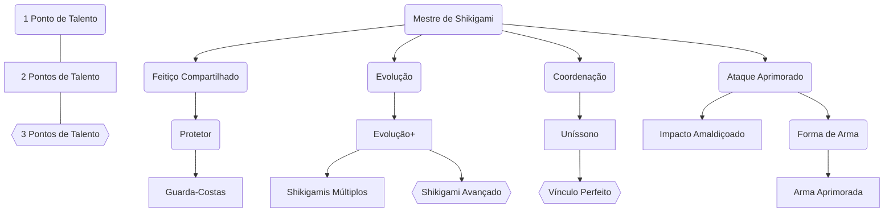

# Mestre de Shikigami

Feiticeiros possuem a capacidade de solidificar sua Energia Amaldiçoada em um Shikigami, um ser vivo constituído da Energia Amaldiçoada do usuário, que determina sua aparência. Os shikigamis são pacíficos com o usuário e seus aliados, não podem ser Encantados, e funcionam como criaturas próprias ao qual o usuário comanda.

Como uma Ação, você pode invocar o shikigami que está vinculado a você. Ele aparece em um espaço desocupado à sua escolha, a até 5 unidades de você.
Em combate, o shikigami compartilha a iniciativa do grupo, atuando como se fosse um personagem de jogador. Em relação às suas ações:
- O Shikigami pode se mover livremente;
- O Shikigami usa a reação de seu mestre para Esquivar ou Trocar Golpes;
- O Shikigami usa a Ação Principal de seu mestre para atacar.

O shikigami permanece até que seus pontos de vida sejam reduzidos a 0, até que você use esta habilidade para invocá-lo novamente ou até que você morra. Tudo o que o shikigami estava vestindo ou carregando é deixado para trás quando ele desaparece. Você pode invocar o Shikigami sem custo de Energia uma vez por descanso, com as invocações posteriores requerindo 5 pontos de Energia.

![[Shikigami_statblock.png]]
## Níveis 2, 4, 6, 8, 10, 12 - Aumento de Atributo
Aumente 1 atributo em +2 ou 2 atributos em +1.
# Técnica Compartilhada
A sintonia entre você e seu Shikigami é aumentada. Todos os bônus e habilidades que seu Feitiço lhe dá são concedidos também ao seu Shikigami, com a exceção de conjuração de Shikigami.
# Protetor
Seu Shikigami lhe protege instintivamente de ataques. Você pode usar sua reação caso ele esteja a 1 unidade de você e você receba dano para transferir o dano para seu Shikigami.
## Guarda-Costas
Você pode usar sua reação caso seu Shikigami esteja a 1 unidade de algum aliado que foi atacado para transferir metade do dano para seu Shikigami.
# Coordenação
Você e seu Shikigami podem atacar juntos. Entretanto, a rolagem de acerto do Shikigami é penalizada com -5. 
## Uníssono
A penalidade na rolagem de acerto dos ataques do Shikigami é reduzida para -2.
## Vínculo Perfeito
A penalidade na rolagem de acerto dos ataques do Shikigami é eliminada. Além disso, você e seu Shikigami compartilham todos os seus sentidos, inclusive para testes de Percepção.
# Evolução
Seu Shikigami fica mais forte. Ele ganha os seguintes benefícios:
- Deslocamento de voo igual ao deslocamento de caminhada.
- Dado de vida aumentado para d6.
## Evolução+
Seu Shikigami evolui ainda mais. Ele ganha os seguintes benefícios:
- Vantagem ao usar a Ação Duelo.
- Deslocamento aumentado para 7 unidades.
## Shikigami Avançado
Seu Shikigami alcança seu auge. Ele ganha os seguintes benefícios:
- Dado de vida aumentado para d8.
- O Shikigami não usa mais a reação de seu mestre para Esquivar ou Trocar Golpes.
- Você pode invocá-lo duas vezes por descanso sem a necessidade de gastar pontos de Energia.
## Shikigamis Múltiplos
Seu conhecimento acerca da conjuração chegou em um ponto onde você consegue conjurar múltiplo Shikigamis. Escolha entre:
- Conjurar 2 Shikigamis de tamanho Médio. Caso tenha o talento "Coordenação", você pode atacar com ambos, usando as mesmas regras de penalidade.
- Conjurar 3 Shikigamis de tamanho Pequeno. Caso tenha o talento "Coordenação", você pode atacar com dois deles simultaneamente, usando as mesmas regras de penalidade.
- Conjurar um Enxame de Shikigamis de tamanho minúsculo. Eles ocupam um quadrado de 1 unidade e agem como uma única criatura. O dano do ataque do enxame recebe um bônus: some seu **mod de Ego** novamente no dano de ataque caso o enxame tenha 50% ou mais de vida.
# Ataque Aprimorado
O ataque do Shikigami é aumentado para 1d8 contundente.
## Impacto Amaldiçoado
Você pode reforçar os golpes do Shikigami com pontos de Energia. O dado de dano aumenta com o nível, e você pode adicionar o dano após o acerto ter sido garantido, inclusive em casos de crítico.

| Nível | Dado | Custo de Energia |
| ----- | ---- | ---------------- |
| 1     | 1d6  | 1                |
| 3     | 1d8  | 2                |
| 5     | 1d10 | 3                |
| 7     | 2d6  | 4                |
| 9     | 2d8  | 5                |
| 11    | 2d10 | 6                |
## Forma de Arma
Você pode fazer com que seu Shikigami assuma a forma de uma arma à sua escolha. Ao atacar com o Shikigami Arma, adicione +1 nas rolagens de acerto e de dano, e adicione 1d6 de dano energético.
## Arma Aprimorada
Seu Shikigami se adapta melhor à forma de arma. Ao atacar com o Shikigami Arma, adicione +2 nas rolagens de acerto e de dano, e adicione 1d10 de dano energético.